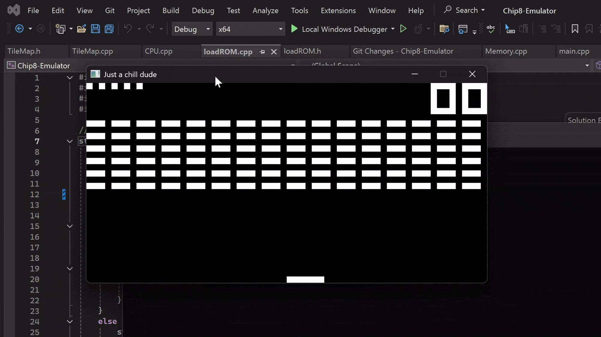

# CHIP-8 Emulator (COSMAC VIP Legacy)

  
  
  

---

## About This Project  
This is a CHIP-8 emulator built from scratch to replicate the original **COSMAC VIP (1977)** behavior.  
It supports the full legacy instruction set, executes at ~700 instructions per second, and updates **timers and display refresh at 60 Hz**.  

I have tested it with titles such as **Pac-Man, Space Invaders, and Wall Breaker**. Some ROMs require **minor compatibility adjustments** or modern quirks to run correctly, which are not yet automated but can be added in future improvements.  

---

## What I Learned  
Through this project I gained experience with:  
- Implementing a CPU interpreter and decoding opcodes  
- Regulating execution speed (~700 IPS) with accurate **60 Hz timers and display refresh**  
- Handling low-level input, audio and graphics  
- Using **SDL3** for graphics and input  
- Debugging across different CHIP-8 ROMs to validate emulator behavior  

This project deepened my understanding of low-level systems, instruction sets, and emulator design.  

---

## Features  
- Legacy CHIP-8 instruction set support  
- Accurate execution (~700 IPS with 60 Hz timers and display refresh)  
- Runs many classic games like Pac-Man, Space Invaders, and Wall Breaker  
- Lightweight and portable  

---

## Controls  

| CHIP-8 | Keyboard |
|--------|----------|
| 1 2 3 C | 1 2 3 4 |
| 4 5 6 D | Q W E R |
| 7 8 9 E | A S D F |
| A 0 B F | Z X C V |

---

## How to Run  
Currently there is no automated build system. To run this project:  
1. Clone the repository.  
2. Open the project in **Visual Studio** (C++ selected).  
3. Install and link **SDL3** manually to the project.  
4. Compile and run from within Visual Studio.  
5. Load a ROM (e.g. Pac-Man, Space Invaders, or Wall Breaker).  

---

## ROMs  

The repository includes a selection of CHIP-8 ROMs for convenience:  

- **`Game-Files/`** → classic CHIP-8 game ROMs (e.g. Pac-Man, Space Invaders, Wall Breaker, etc.)  
- **`Test-Files/`** → test ROMs for debugging and validation (opcode tests, display tests, timers, etc.)  

These ROMs are widely available online and are provided here **for educational purposes**.  

---

## Improvements and Future Work  
- Compatibility enhancements → add modern quirks support to run titles like Space Invaders without manual changes  
- Flickering handling → address screen flicker behavior for stricter authenticity  
- Input behavior → original hardware beep on key hold removed (can be reintroduced as option)  
- Display sync → currently does not wait for vertical blanking; could be added for stricter timing  
- Raspberry Pi port → run the emulator on a Raspberry Pi for a more authentic retro experience  

---

## Credits  
Built by **Sahin Halil** (all rights reserved).  
